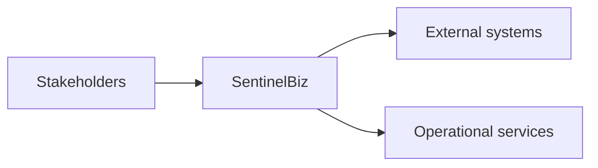

# Architecture

## Purpose

Describe the major boundaries, responsibilities, and interactions of SentinelBiz.

## Architectural intent

The architecture should isolate business decisions from user interfaces,
external integrations, persistence, and operational tooling.

## System context

The external systems and operational services are intentionally unspecified until
the requirements baseline is approved.

## Quality goals

- Clear separation of concerns
- Secure-by-default boundaries
- Observable business-critical flows
- Replaceable infrastructure integrations
- Predictable failure behavior

## Decisions pending

- Deployment topology
- Data ownership boundaries
- Integration style
- Availability and recovery targets
