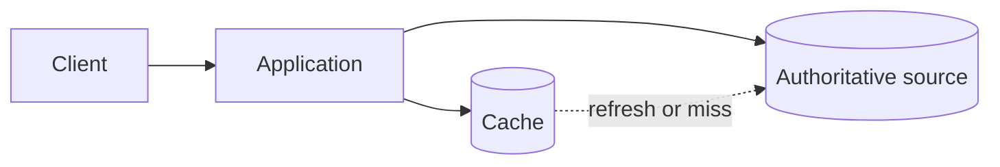

# Caching

## Purpose

Define where caching may be used and how correctness is preserved.

## Caching principles

- Cache only data with a clear performance benefit.
- Define freshness and invalidation behavior for every cache.
- Never let a cache bypass authorization.
- Treat cache loss as an expected operational condition.
- Measure hit rate, latency, and stale-read impact.

## Candidate locations

Caching decisions depend on the read patterns and consistency requirements that
are not yet documented.
