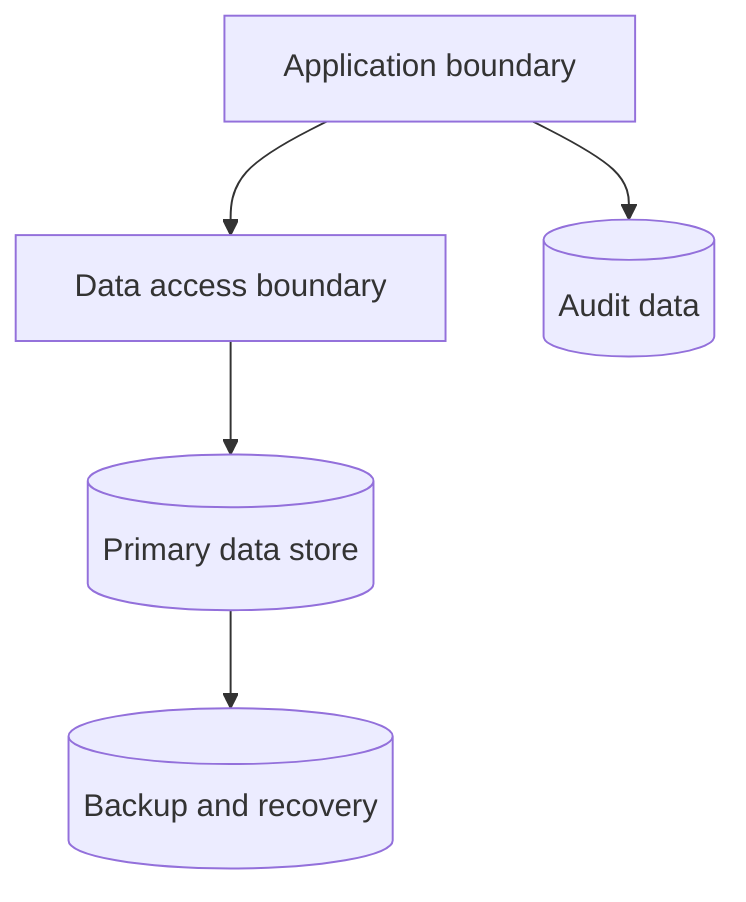

# Database Architecture

## Purpose

Document the database responsibilities, boundaries, and operational expectations
for SentinelBiz.

## Logical boundary

The storage technologies and topology are intentionally not selected yet.

## Concerns to resolve

- Consistency and transaction boundaries
- Indexing and query patterns
- Backup and restore objectives
- Encryption and access control
- Migration and change-management process
