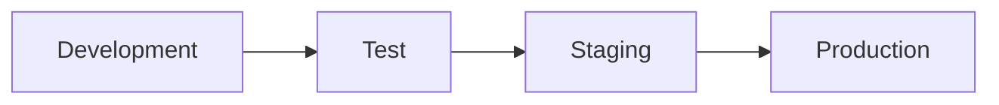

# Deployment

## Purpose

Describe how SentinelBiz is promoted across environments and operated safely.

## Environment model

## Deployment principles

- Keep environments isolated.
- Promote the same tested artifact where practical.
- Manage configuration separately from application behavior.
- Define health checks, rollback, and recovery procedures.
- Record who approved and performed each production change.

## Decisions pending

- Hosting platform and regions
- Availability and recovery objectives
- Release strategy
- Environment-specific dependencies
