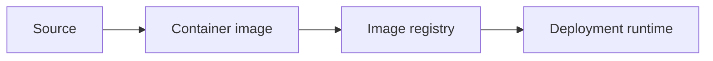

# Docker

## Purpose

Document containerization decisions for SentinelBiz without coupling the design
to an implementation prematurely.

## Container concerns

- Minimal runtime surface
- Reproducible builds
- Non-root execution where supported
- Explicit configuration and secret handling
- Health and readiness behavior
- Image provenance and vulnerability scanning

## Lifecycle

## Status

Container boundaries and runtime requirements are not yet approved.
