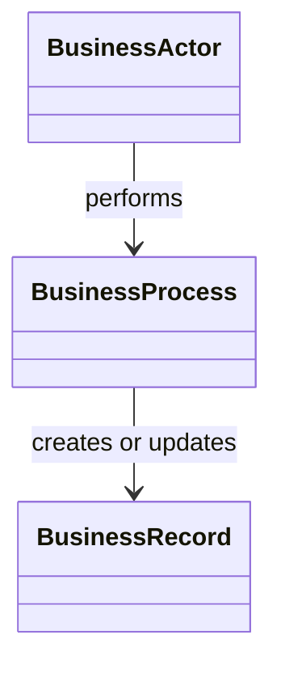

# Domain Model

## Purpose

Define the business concepts, invariants, and relationships that form the core
of SentinelBiz.

## Initial model

This is a conceptual placeholder, not an approved model.

## Modeling rules

- Use language agreed upon by business and technical stakeholders.
- Record invariants next to the concept they constrain.
- Distinguish identity, lifecycle, and ownership.
- Avoid modeling storage details as domain concepts.

## Open questions

- What are the principal business entities?
- Which lifecycle transitions are valid?
- Which invariants must always hold?
