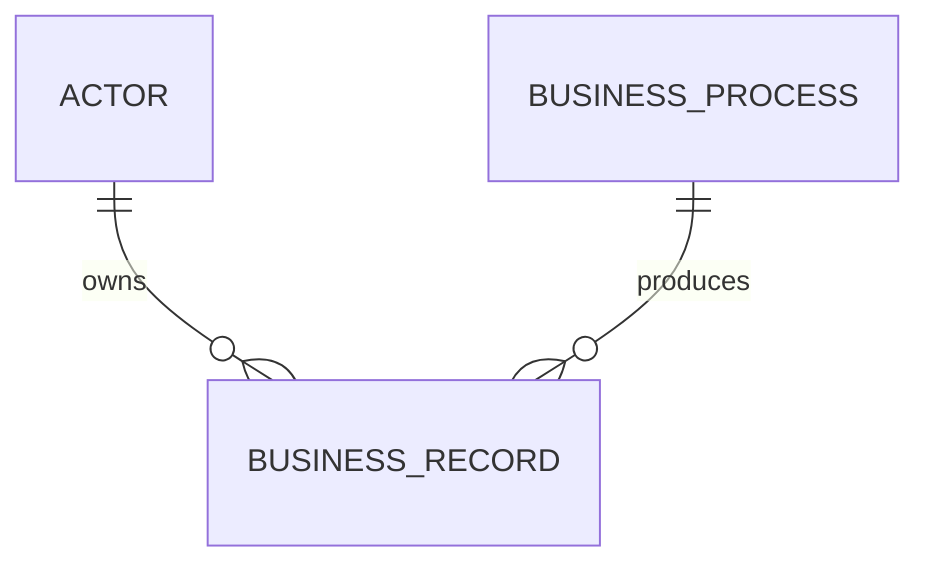

# Entity Relationship Diagram

## Purpose

Describe the persistent data entities and their relationships after the domain
model has been agreed.

## Conceptual ERD

The entity names and cardinalities are provisional.

## Data design principles

- Store only data with a clear business or operational purpose.
- Define ownership, retention, and access for each sensitive attribute.
- Make relationships and deletion behavior explicit.
- Keep persistence design aligned with the domain model.

## Pending decisions

- System of record for each entity
- Retention and archival rules
- Audit history requirements
- Reporting and query patterns
