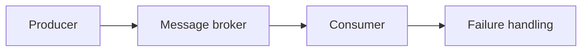

# Messaging

## Purpose

Describe asynchronous communication, event ownership, delivery guarantees, and
failure handling for SentinelBiz.

## Event flow

This is a conceptual diagram only. A broker and delivery model have not been
selected.

## Decisions to make

- Event versus command semantics
- Delivery guarantee
- Ordering and deduplication
- Retry and dead-letter behavior
- Schema evolution
- Ownership and retention
