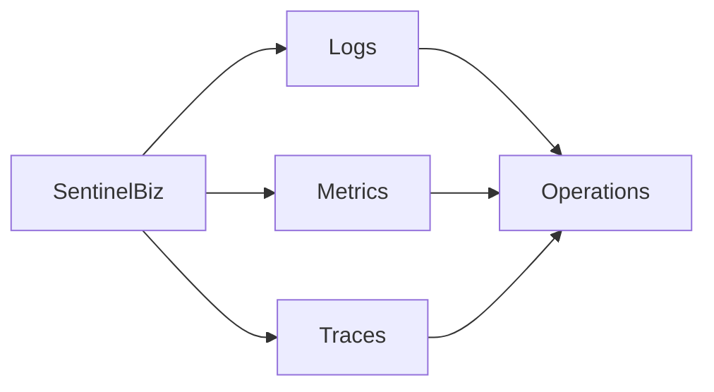

# Observability

## Purpose

Define how SentinelBiz exposes health, behavior, performance, and failures.

## Signals

- Logs: structured records for diagnosis and audit
- Metrics: measurements for health, capacity, and business outcomes
- Traces: end-to-end context across boundaries

## Operational view

## Requirements to define

- Service-level objectives
- Alert thresholds and ownership
- Correlation and trace identifiers
- Sensitive-data redaction
- Retention and access controls
- Incident and escalation workflow
