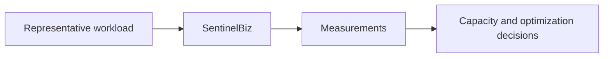

# Performance

## Purpose

Define performance expectations, measurement methods, and capacity assumptions.

## Measures

- Response-time percentiles
- Throughput
- Resource utilization
- Queue or processing delay
- Error and timeout rates
- Capacity headroom

## Measurement flow

## Targets

No performance targets have been approved. Targets should be stated as
measurable thresholds by workflow and workload.

## Principles

- Measure realistic workloads.
- Separate warm-up effects from steady-state results.
- Test failure and saturation behavior.
- Treat performance as a quality attribute, not a final-stage activity.
