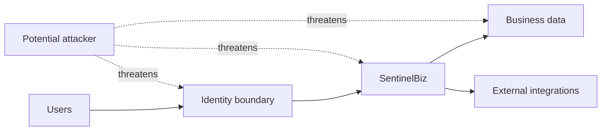

# Security Model

## Purpose

Define how SentinelBiz protects identities, data, operations, and integrations.

## Security objectives

- Preserve confidentiality, integrity, and availability.
- Apply least privilege and separation of duties.
- Protect secrets and sensitive data throughout their lifecycle.
- Make security-relevant actions auditable.

## Threat model scope

## Controls to define

- Authentication and session management
- Authorization model
- Input validation and abuse prevention
- Encryption in transit and at rest
- Logging, monitoring, and incident response
- Data retention and privacy handling
