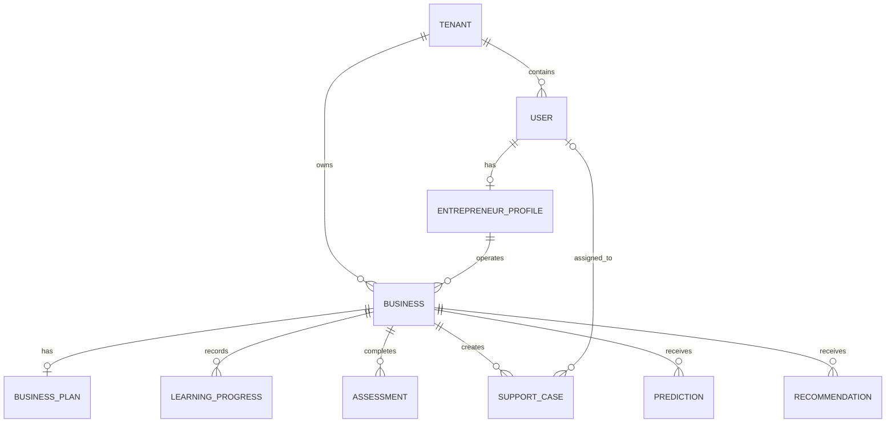

# PostgreSQL — Conceptual ERD

This is a conceptual ERD, not an implementation schema. Keys, normalization, indexes, constraints, retention, and migration strategy are to be finalized before implementation.
