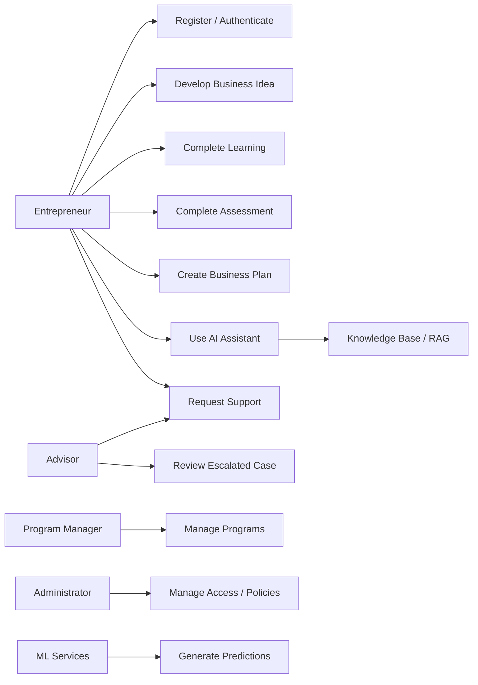

# UML — Use Case Model

```mermaid
flowchart LR
    E[Entrepreneur] --> R[Register / Authenticate]
    E --> I[Develop Business Idea]
    E --> L[Complete Learning]
    E --> A[Complete Assessment]
    E --> P[Create Business Plan]
    E --> AI[Use AI Assistant]
    E --> S[Request Support]

    AD[Advisor] --> S
    AD --> REV[Review Escalated Case]
    PM[Program Manager] --> PROG[Manage Programs]
    ADM[Administrator] --> SEC[Manage Access / Policies]
    AI --> KB[Knowledge Base / RAG]
    ML[ML Services] --> PRED[Generate Predictions]
```

This is a conceptual use-case view; detailed UML tooling can refine notation without changing the business intent.
