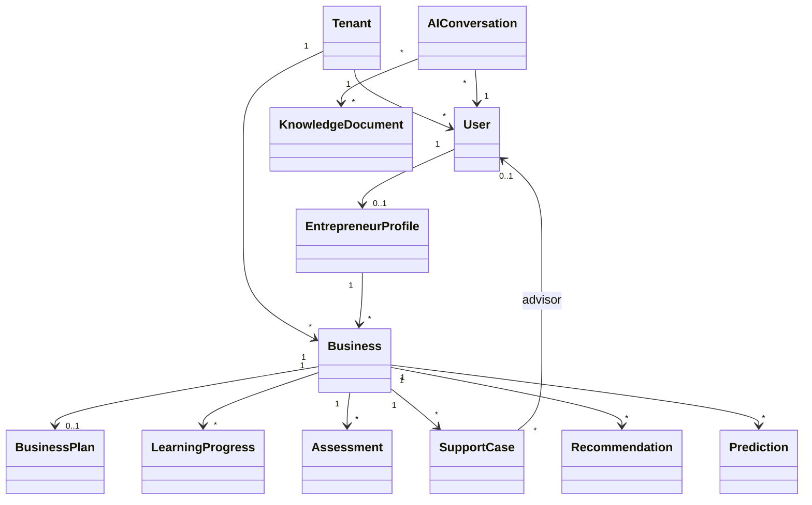

# UML — Domain/Class Model

```mermaid
classDiagram
    Tenant "1" --> "*" User
    Tenant "1" --> "*" Business
    User "1" --> "0..1" EntrepreneurProfile
    EntrepreneurProfile "1" --> "*" Business
    Business "1" --> "0..1" BusinessPlan
    Business "1" --> "*" LearningProgress
    Business "1" --> "*" Assessment
    Business "1" --> "*" SupportCase
    Business "1" --> "*" Recommendation
    Business "1" --> "*" Prediction
    SupportCase "*" --> "0..1" User : advisor
    AIConversation "*" --> "1" User
    AIConversation "*" --> "*" KnowledgeDocument
```

The diagram is conceptual and does not prescribe database tables or implementation classes.
