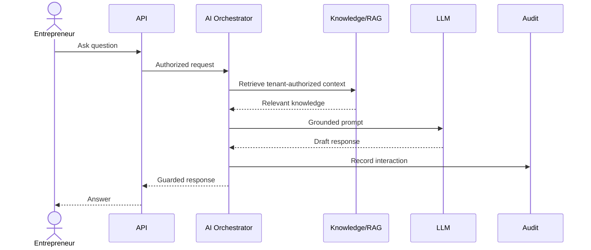
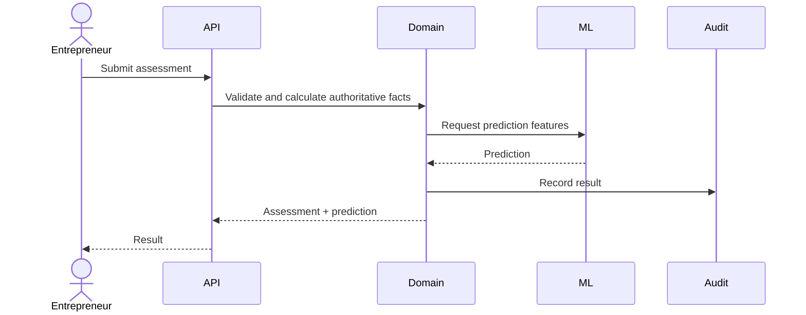

# UML — Sequence Flows

## AI-assisted knowledge question

```mermaid
sequenceDiagram
    actor Entrepreneur
    participant API
    participant AI as AI Orchestrator
    participant RAG as Knowledge/RAG
    participant LLM
    participant Audit

    Entrepreneur->>API: Ask question
    API->>AI: Authorized request
    AI->>RAG: Retrieve tenant-authorized context
    RAG-->>AI: Relevant knowledge
    AI->>LLM: Grounded prompt
    LLM-->>AI: Draft response
    AI->>Audit: Record interaction
    AI-->>API: Guarded response
    API-->>Entrepreneur: Answer
```

## Predictive assessment

```mermaid
sequenceDiagram
    actor Entrepreneur
    participant API
    participant Domain
    participant ML
    participant Audit

    Entrepreneur->>API: Submit assessment
    API->>Domain: Validate and calculate authoritative facts
    Domain->>ML: Request prediction features
    ML-->>Domain: Prediction
    Domain->>Audit: Record result
    Domain-->>API: Assessment + prediction
    API-->>Entrepreneur: Result
```
