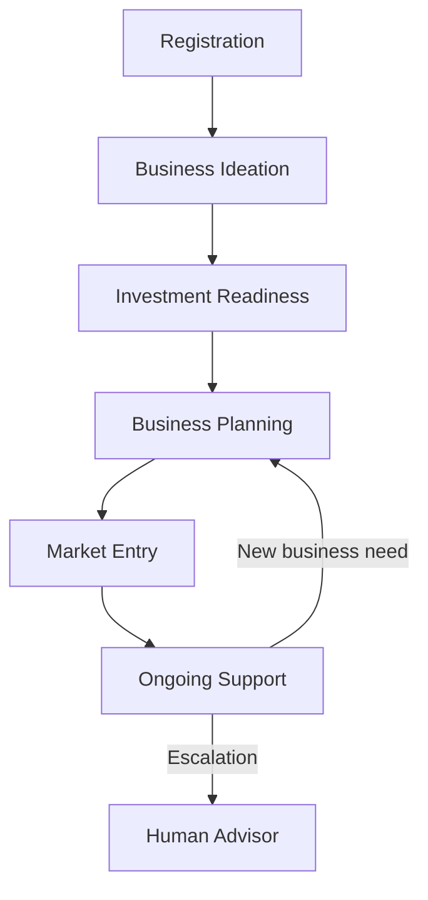
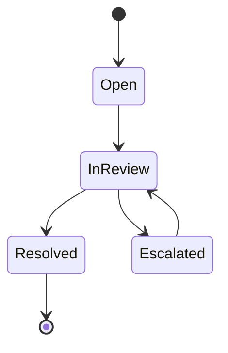

# UML — Activity and State Models

## Entrepreneur journey

```mermaid
flowchart TD
    R[Registration] --> I[Business Ideation]
    I --> IR[Investment Readiness]
    IR --> BP[Business Planning]
    BP --> ME[Market Entry]
    ME --> OS[Ongoing Support]
    OS -->|New business need| BP
    OS -->|Escalation| H[Human Advisor]
```

## Support case states

```mermaid
stateDiagram-v2
    [*] --> Open
    Open --> InReview
    InReview --> Resolved
    InReview --> Escalated
    Escalated --> InReview
    Resolved --> [*]
```

Exact state names and transition guards are to be finalized with the domain specification.
