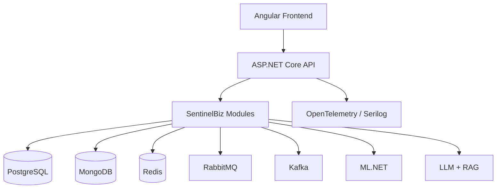
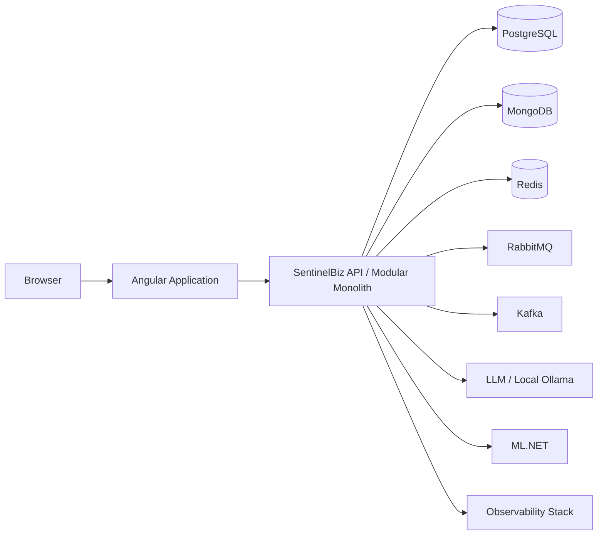

# UML — Component and Deployment Models

## Components

## Deployment concept

The deployment model is logical; production topology, replicas, networking, and orchestration are implementation-stage concerns.
