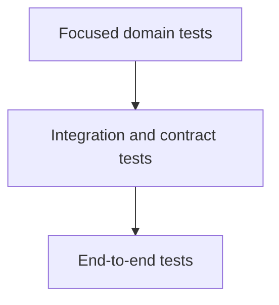

# Testing Strategy

## Purpose

Define how SentinelBiz will demonstrate correctness, security, reliability, and
fitness for purpose.

## Test levels

- Domain and business-rule tests
- Component and integration tests
- Contract tests
- End-to-end workflow tests
- Security and resilience tests
- Performance and capacity tests

## Test pyramid

## Quality gates

Gates should be based on risk and measurable acceptance criteria rather than
coverage alone.

## Open questions

- Which workflows are business-critical?
- What test data may be used?
- What performance and availability targets must be verified?
