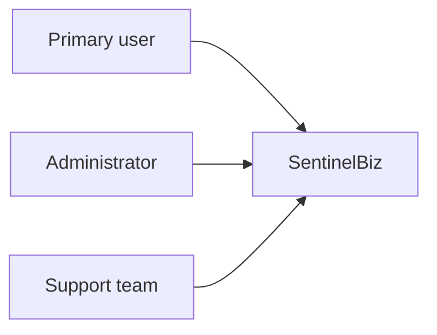
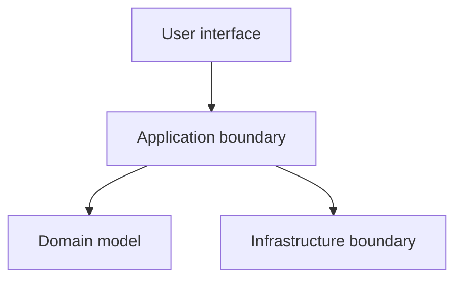

# UML

## Purpose

Maintain UML views that communicate the structure and behavior of SentinelBiz.

## Use-case view

## Component view

These are placeholders and must be refined after the requirements and domain
vocabulary are approved.

## Modeling conventions

- Use nouns for domain concepts.
- Use verbs for behaviors and interactions.
- Show ownership and cardinality where they matter.
- Keep diagrams focused on one question.
